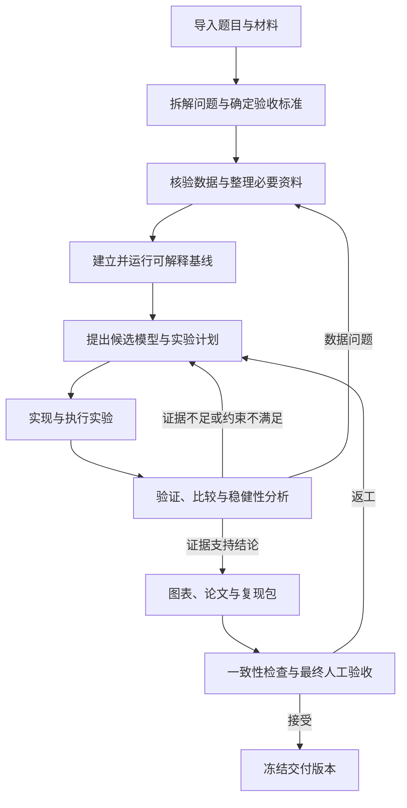

# 数模工作流设计 v1

状态：设计提案，尚未实现。日期：2026-09-22。
适用：mathmodel-agent 单仓库；frontend 为未来工作台，backend 为项目内部服务，codex-runtime 为自行构建的执行内核。

## 1. 当前能力与设计目标

当前 v2 实现的是单任务 Run：创建任务 → Codex 执行 → awaiting_review → 人工接受后 completed。
已有持久化、幂等、版本检查、权限审批、取消和不确定执行恢复；没有跨任务编排、产物版本、实验实体和科学验证器。
本文所有新增对象、命令、目录和自动推进规则均为拟议设计，不代表当前 API 已支持。

目标：用户提供题目、材料、时间与算力约束，系统交付可复现的模型、代码、实验结果、图表和报告；每个关键结论能反查数据与计算证据。
第一版使用单执行器串行调度，先完成一题的端到端闭环。流程可以回退修订；不要求所有题目使用相同模型、固定图表数量或固定数量的专业 Agent。

## 2. 用户可见的工作流程



上图描述业务循环；每次返工创建新修订和新步骤实例，单个执行计划仍然是无环依赖图，避免覆盖历史。
没有外部数据的理论题允许数据阶段输出“不适用及理由”，使用推导、合成算例或反例验证，必须标注合成数据。
多个小问分别建立分支，显式声明小问间的数据、参数和结论依赖；第一版按拓扑顺序串行执行。

| 阶段 | 主要工作 | 必须保留的产物 | 进入下一阶段的条件 |
| --- | --- | --- | --- |
| 材料接收 | 保存题目与附件原件，提取文本、表格与公式，检查工具环境 | 输入清单、原件哈希、提取结果、环境检查 | 原件可定位；关键公式或表格识别不确定时明确列出 |
| 问题拆解 | 每小问的目标、变量、单位、约束、输出形式及验收标准 | problem-spec、假设清单、问题依赖、开放问题 | 每个小问都有可检查的交付；影响路线的歧义得到解决或被明确列为假设 |
| 数据与资料核验 | 缺失、异常、量纲、样本划分、数据泄漏检查，按需检索 | data-report、数据版本、清洗代码、来源记录 | 输入来源可追溯；不能把猜测数据冒充事实；处理规则可复现 |
| 基线 | 先构造最简单且满足问题约束的解法，真实运行 | baseline-model、代码快照、实验记录、基线指标 | 成功执行且约束检查通过；不能仅凭生成了一段代码通过 |
| 候选与计划 | 针对基线缺点提出有依据的模型，定义比较方法与停止条件 | model-spec、experiment-plan、成本估计 | 数学定义、指标方向、对照方法、预算明确；新方案需说明改进假设 |
| 实现与实验 | 编码、单元/性质检查、求解、记录环境、种子、参数与日志 | experiment、代码/环境快照、原始指标与输出 | 退出状态明确、结果文件齐全；执行失败不能伪装为有效科学结果 |
| 验证与选择 | 与基线比较，检查可行性、残差、敏感性和稳健性 | verification-report、比较表、证据支持的结论 | 必要检查通过；改进无效时允许保留基线，明确局限 |
| 写作与交付 | 从冻结结果生成图表和正文，编译并检查实际渲染 | 报告/PDF、图表源数据与脚本、复现说明、交付清单 | 数字、单位、图表、引用与计算一致；回答全部小问；最终人工接受 |

文献检索、数据探索和论文提纲可以早做；最终摘要、数值结论和图表只能引用已登记的结果版本。
比赛规则、语言、页数和 AI 使用声明来自本次用户提供或核验的规则配置，不能硬编码成跨年度通用规则。

## 3. 三层责任

- 业务编排层（backend）：拥有 Workflow、依赖、预算、版本、人工决定与调度权，决定下一步是否可执行。
- 执行层（codex-runtime）：读取本步上下文、推理、调用工具、写代码与执行；返回候选产物和执行记录。
- 领域能力层（后续项目自有 Skills）：描述问题分析、建模、实验、验证和写作的方法；不直接决定数据库终态，也不自行跳过检查。

Codex 内部可在一次任务中多轮调用工具，但跨步骤推进必须由业务状态驱动。模型输出“完成”只代表候选结果。
先通过现有适配器实现工作流；涉及内核修改时，以实际缺失的执行能力为依据，并单独验证。

## 4. 新增业务对象与已有对象的关系

| 对象 | 核心内容 | 关系及约束 |
| --- | --- | --- |
| Workflow | 题目目标、状态、当前计划版本、预算策略 | 属于 Project；一个完整建模任务可包含多个 Run |
| PlanRevision | 不可变步骤、依赖、输入绑定、验收标准 | 变更产生新版本；旧版本可审计 |
| Step | 阶段、小问、角色、输入版本、输出规范、验证策略 | 每次执行绑定一个现有 Run；改变任务说明创建新 Run |
| ArtifactVersion | 内容摘要、类型、大小、存储位置、生产者、父版本 | 指向不可变内容；保留输入版本、Run/Attempt 来源 |
| Experiment | 代码/数据/环境版本、命令、参数、种子、资源预算、退出状态、指标 | 一次实际计算一条记录；实验记录与模型的文本总结分离 |
| Verification | 被检对象、检查方法、原始证据、结果、验证器版本 | 结果为 pass/fail/inconclusive；未知不得解释为通过 |
| Claim | 正文主张、单位/适用范围、证据定位 | 关联指标、图表或来源位置，区分结果、假设与推测 |
| GateDecision | 计划/结果的人工决策、理由、目标版本 | 绑定精确版本；复用现有 Run review，不混同运行权限审批 |

复用 Project / Run / Attempt / Approval / Review / Event，不把现有 Run 偷换为整场比赛。
“重新执行相同任务”沿用 retry_run 的条件；“改模型、改输入、改验收标准”产生新的 Step 修订和 Run。

## 5. 状态、验收与自动推进

建议 Workflow 状态：draft、active、waiting_user、pausing、paused、blocked、completed、cancelled。
Step 状态：pending、ready、executing、awaiting_review、accepted、failed、blocked、cancelled；另有 stale 标记表示输入或计划已被替代。
Run 状态保持现有 v2 语义，不把 awaiting_review 映射为 accepted，也不把 recovery_required 映射为可重试。

调度条件：工作流 active、依赖已 accepted 且非 stale、输入摘要匹配、预算可用、没有未决恢复冲突。
Codex 正常结束 → 收集并登记候选产物 → 运行预定义验证 → 展示证据 → 人工验收 → 才能释放下游。
自动检查失败时阻止接受该版本；修正检查或结果必须留下新版本和理由。

第一版保留每个 Run 的人工验收，以兼容现有契约。重点展示路线/假设、基线与实验方案、最终交付三个决策点，但中间结果也不能自动冒充人工接受。
后续若减少确认，单独设计自动验收策略与 service 身份、支持的确定性检查和审计事件；不能让模型调用 review_run 假扮用户。
运行时命令/文件权限审批仍由现有 Approval 处理，与科学结果 Review 独立。

Pause 默认等待当前 Run 结束并阻止派发下一步；需要立即停止时显式取消当前 Run。
Cancel 阻止后续派发，依现有语义处理进行中的 Run，保留已发生的文件和计算记录，不假装回滚。
运行状态不确定时 Workflow blocked，先 reconcile_run；不得通过超时自动重发未知副作用。

## 6. 产物与上下文交接

每步上下文包包含：题目版本、本步目标、冻结输入产物、相关假设、前序结果摘要、验收条件、可用工具、预算和已知失败。
只选择本步需要的上下文；完整历史保留在事件与产物库，不依赖无限增长的对话。
每次 Attempt 保持新线程，通过上下文包恢复领域知识，不靠重复注入所有聊天记录。

建议运行数据布局（仓库外，非源码目录）：

```text
project/
  inputs/                   原始资料及登记清单
  artifacts/sha256/          已登记的不可变产物内容
  work/<step-id>/<attempt>/  本次执行的可写区域
  exports/<revision>/        已验收交付的固定快照
```

现有代码使用项目级共享 workspace，以上 Attempt 隔离与内容库需要新增实现；未完成隔离前不得宣称具备并行任务安全或强版本保护。
产物由服务验证路径与内容后登记：拒绝越界/符号链接逃逸，流式计算摘要，原子发布；提示词中的“只读”不算隔离机制。
复制/快照只读输入与限制运行沙箱的写范围需要一并实现。数据库发布引用前确认内容落盘；崩溃留下的无引用内容可延迟回收，不产生缺失文件的已验收引用。
模型提交的 manifest 是候选声明，不能作为文件真实存在、命令实际执行或指标真实有效的唯一证据。
实验日志及退出状态由执行记录采集；指标由版本化脚本从原始结果计算。

上游数据、模型或假设改变后，沿依赖将后代标记 stale，保留历史结果与历史验收。
正在运行的旧版本结果可以保存，但不能自动成为新计划的有效产物；用户已导出的交付版本保持不变。

## 7. 科学验证与停止条件

所有题目：变量/量纲/约束一致、公式与代码对应、结果可重算、结论不超出数据支持范围。
预测题：预先固定训练/验证/测试划分，时间序列使用时间方向切分，模型选择不得反复使用保留测试集。
优化题：检查可行性、目标值重算、求解器状态与 gap；启发式结果不能称为已证明全局最优。
仿真题：记录随机种子和重复次数，报告不确定性，测试边界情形与参数敏感性。
理论题：列清前提、验证推导与边界情形；数值算例不能替代证明。
这些按题型选择，检查阈值在实验前定义，不能看到结果后放宽以强行通过。

预算在执行前固定：截止时间、最多实验数、单次执行超时、最大修订轮数及可执行的算力限制。
模型费用/Token 若没有可靠实时计量，只能标为估算软阈值，不能声称是硬上限。
达到预算或改进停止条件时，交付已验证的最佳现有方案和未解决问题；无有效结果则报告失败，不补造结论。
验证角色可用新线程顺序执行，但同一模型复核不等于独立正确性证明；确定性检查和人的判断仍须保留。

## 8. 契约落地建议

现有 /v2 与 schema 保持兼容。新增 Workflow 服务及版本化契约，建议作为 /v3 的独立增量：
create_workflow、propose_plan、accept_plan、start_workflow、pause_workflow、resume_workflow、cancel_workflow、revise_step。
最终冻结交付采用 finalize_workflow，必须校验所有必需步骤、证据和人工接受均对应当前版本。
这些是拟议命令，不可直接调用当前服务。
新命令继续携带 idempotency_key；修改命令携带 expected_version，计划决定还绑定 plan_revision。
先提供 Workflow 快照与游标事件读取，沿用轮询；前端完成前可用 CLI/HTTP 驱动。

调度器必须在同一 SQLite 事务中写入派发意图、Step→Run 关联和事件；使用唯一键防止重启重复创建 Run。
底层执行继续使用现有“先落盘、后派发”的恢复语义。Workflow 与 Run 同处内部服务，不引入另一套 Daedalus 服务。

## 9. 实施次序和第一版验收

1. 产物与实验底座：不可变输入/输出、内容摘要、实验记录、Attempt 工作区隔离。
2. 串行工作流：Workflow/PlanRevision/Step，依赖、Run 关联、人工检查点、事件和暂停恢复。
3. 数模模板：问题分析、数据、基线、模型/实验、验证、报告；每步有输出规范和验证器。
4. 真实闭环：配置真实模型，用一题跑完，比较真实产物和预期结果；之后再扩展多小问、多候选模型和前端。

验收样例选一个可独立核算的小型选址题：给定需求权重、候选点、距离矩阵，选择 p 个站点最小化加权服务距离。
基线采用贪心，候选采用整数规划；小规模枚举作为目标值与可行性的独立核对方法。
交付题目规格、输入快照、基线与候选代码、实际执行记录、约束/目标值核算、敏感性结果、图表和报告。
同环境下按说明复算满足预先声明的容差；这只证明样例与基础机制，不证明任意数模题效果。

必须覆盖的故障验收：

- 进程重启不重复派发；未知执行保持 blocked，核对后才能继续。
- 上游数据修订使下游失效；旧结果不能进入新版本论文。
- 脚本失败、文件缺失、指标捏造、验收拒绝均不能进入交付。
- 达到预算停止新增实验；暂停后不派发新步骤；取消保留可审计记录。
- 重复命令返回同一回执，陈旧版本决策被拒绝。

## 10. 参考依据与取舍

- 本项目 `backend/contracts/v2/README.md`、`backend/server/service.mjs`：现有业务状态及执行边界。
- 本地 Math Model 的 `README.md` 与 `recovery/evidence/workflow_templates.json`：参考赛题分析、建模、编程、绘图、写作、编译以及检查点的组织方式；不移植反编译引擎。
- 本地 Claude Science 分析文档 `analysis/CLAUDE_SCIENCE_PRODUCT.md`：借鉴产物版本、证据关联与结果复核的产品思路；它是本地恢复/分析材料，不作为官方能力承诺，不复制其实现。
- [Mathodology README](https://github.com/sweetcornna/mathodology)（2026-09-22 查阅）：参考从题目和证据选择方法、可解释基线、结果验证、可复现计算及按需角色；其当前说明不要求固定九阶段。

本方案为上述需求与当前代码约束下的新设计。参考工作流不作为运行依赖；第一版不预设多 Agent 并行，不实现通用可视化 DAG 编辑器。

## 11. 调度参考补充

进一步核对 Math Model 调度实现后的取舍和待查范围见
[调度参考核对](math-model-scheduler-review.md)。本节补充前述设计：

- Step 增加 skipped：仅限允许跳过的可选步骤，记录理由；不等同 accepted。
- 检查点区分接受、要求当前步骤返工、停止；补充后续要求与当前返工不混淆。
- 检查点超时保持等待，重启后仍须保留未决状态。
- 文件无变化只是进度诊断信号，不能单独判定求解器失效或直接触发重跑。
- 论文续写或产物修复形成新任务，保留失败版本并重新验收。
