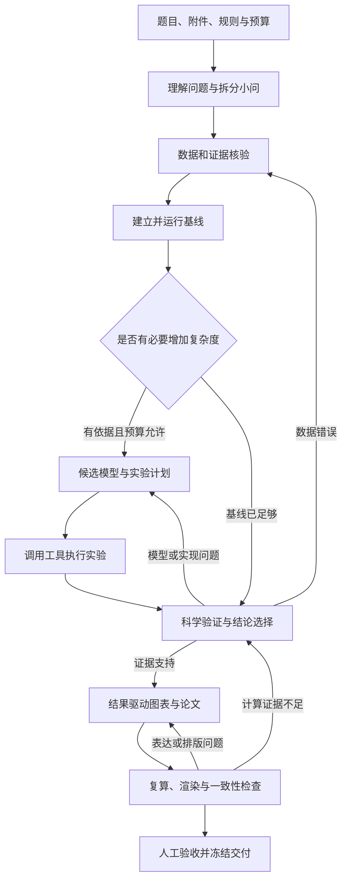

# Mathmodel Agent 统一数学建模工作流

日期：2026-09-22。状态：目标设计，服务端跨任务自动编排尚未实现。

实施更新：已提供 [本地 Agent 工作流](../workflow-quickstart.md)，通过 Skill、Python 脚本和 Codex 启动入口运行整条链路。
它采用文件记录与单执行器，不等同于本文拟议的服务端 Workflow/ArtifactVersion API；本地阶段登记也不替代 v2 人工 Review。

## 适用范围

本文是项目数学建模工作流的统一设计入口，整合既有工作流、调度审查、参考仓库评估和现有后端契约。
目标是让题目理解、数学建模、工具执行、科学验证和论文交付形成可恢复的闭环。
本文中的模块、字段和新增接口属于设计，不是当前可调用 API；实际能力以 v2 契约和代码为准。
原始分析保留作为证据，不把执行内核的所有开发文档混入建模流程。

核心定位：math-model 和 mathodology 提供领域方法、模块组织和工具使用思路；本项目的 backend 承担可靠编排，codex-runtime 承担执行，frontend 展示进展与结果。

## 1. 文档整合与冲突处理

| 材料 | 纳入统一工作流的内容 | 处理方式 |
| --- | --- | --- |
| [工作流 v1](math-workflow-v1.md) | 阶段、业务对象、版本、验证、实施次序 | 本文统一展开，保留原提案 |
| [调度参考核对](math-model-scheduler-review.md) | 检查点、恢复、跳过、返工、进度信号 | 纳入第 6 节；保留其静态抽查范围限制 |
| [参考仓库评估](references/参考仓库评估与架构建议.md) | 领域技能、工具适配、工作台、来源链 | 采用职责划分；早期 Python/FastAPI 建议由现有 Node 后端事实取代 |
| [Claude Science 完整性复评](references/Claude-Science-完整性复评-2026-09-07.md) | 构建、接线与真实任务效果的区别 | 用于验收分层；不把可构建当作建模能力已完成 |
| [实现记录](../../IMPLEMENTATION.md)、[后端范围](../../backend/docs/implementation/core-scope.md) | 当前已经完成的执行底座 | 历史记录，不扩张为完整数模产品 |
| [后端说明](../../backend/README.md)、[v2 契约](../../backend/contracts/v2/README.md) | Run、Attempt、审批、人工验收、恢复 | 作为当前接入边界；旧 v1 契约仅作历史参考 |
| [前端说明](../../frontend/README.md) | 前端工程基座及未来接入范围 | 工作台后置，首版可通过本机命令驱动 |
| backend/frontend 的 docs/standards | 命名、边界、测试、ADR、文档和门禁 | 作为开发约束保留，不转换成每道题的建模步骤 |
| [Mathodology 工作方式](https://github.com/sweetcornna/mathodology/blob/main/docs/WORKFLOWS_zh.md) | 围绕问题、基线、反证和证据表达工作 | 按任务选用模块，不固定模型或图表数量 |
| [Mathodology 技能索引](https://github.com/sweetcornna/mathodology/blob/main/docs/SKILLS_zh.md) | 领域能力与专业角色分离 | 参考能力组织，不把安装提示词视为工具已接通 |

本地实现基线：`2cbe35ec749f17a31e78c7b5c937a55db56af5a6`，另包含本次整合前已有的未提交设计文档。
外部页面查阅日期为 2026-09-22；链接指向可变化的 main，不代表固定依赖或整库审计。
references 中两篇文档是早期本地总结的原样存档，其日期、路径和状态均是历史信息。

遇到矛盾时：当前代码和可执行契约决定当前行为；本文定义目标设计；历史建议只解释来源。
统一仓库已经采用 Node.js/SQLite 后端和源码 Codex，不重新建立 Daedalus/Theia 两套独立服务。

## 2. 一条主线，按问题组合模块



这是业务迭代图；每次回退生成新计划修订，单次计划保持无环依赖。
多小问按共享数据、参数和结论建立依赖；首版按拓扑顺序串行执行。
论文提纲、文献检索可以提前，但最终数字和结论只引用已验证的结果版本。

三种入口共用同一套模块：

- 完整建模：从原始题目开始，覆盖所有必需产物。
- 继续已有成果：先登记并检查现有代码、数据和论文，从尚缺的环节继续，不补造历史执行记录。
- 局部任务：只做求解、验证、绘图或报告；交付范围明确，不宣称完成整道题。

理论题允许数据模块说明“不适用”，改用推导、反例或标注清楚的合成算例；数值算例不代替证明。
候选改进和额外检索可按理由跳过，科学验证与本次请求对应的交付检查不能省略。

## 3. 功能模块与交接契约

下表是能力目录，不要求每个模块单独启动一个 Agent。一个执行器可以依次承担不同角色。
产物名称是建议的逻辑类型，允许合并文件；后端按结构和来源验收，不按文件名或文件大小判定成功。

| 模块 | 输入 | 核心工作与工具需求 | 输出 | 完成条件与失败去向 |
| --- | --- | --- | --- | --- |
| intake 材料接收 | 题目、附件、规则、时限 | 原件登记；PDF/表格读取；必要时 OCR；环境探测 | input-manifest、提取材料、环境报告 | 原件可定位，公式和表格疑点列明；关键材料缺失则等待补充 |
| problem 问题分析 | 提取材料、用户目标 | 分小问，定义变量、单位、目标、约束、假设及验收标准 | problem-spec、question-dependencies、assumptions | 每小问都有可检查输出；影响解法的歧义有处理记录 |
| evidence 数据与证据 | 问题规格、原始数据 | 数据剖析、清洗、来源核验；按需检索原始文献 | data-report、cleaning-code、sources、数据版本 | 缺失/异常处理可复算，来源可信度说明；不能用猜测补成事实 |
| baseline 基线 | 冻结数据、问题规格 | 最简有效模型、代码执行、约束核算 | baseline-spec、代码、Experiment、指标 | 实际运行且满足基本约束；失败回到数据/建模 |
| modeling 模型设计 | 基线不足、领域证据 | 定义数学模型、参数识别、适用条件、比较方案和停止条件 | model-spec、experiment-plan | 增加复杂度有理由，指标方向和阈值预先确定 |
| compute 计算实验 | 冻结代码/数据/参数与预算 | Python/求解器/仿真执行；采集日志、退出状态和环境 | Experiment、原始输出、指标表 | 退出状态明确，指标可由原始结果重算；失败记录分类 |
| verify 科学验证 | 模型、实验、基线、假设 | 检查公式与代码对应、可行性、误差、敏感性和反例 | Verification、comparison、claims | pass/fail/inconclusive；问题定位到数据、模型或代码并返工 |
| communicate 图表论文 | 当前有效结果、主张证据、比赛规则 | 数据驱动绘图、写作、引用核验、编译和实际页面检查 | figures、report、citation-ledger | 每个关键数字有来源，全部小问得到回应，排版可读 |
| deliver 复现交付 | 已验收产物、环境与复算说明 | 从固定快照复算；核对交付清单与规则；打包 | reproduction、delivery-manifest、冻结交付版本 | 可在声明环境复算；人工接受当前版本；未解决问题显式列出 |

跨模块能力包括：来源记录、版本管理、预算、工具调用记录、事件与恢复。它们由后端统一提供。

模块定义的最小字段建议为：

```text
id / version / purpose
input_types / output_types
required_capabilities / optional_capabilities
acceptance_checks / retry_policy
context_recipe / implementation_ref
```

Skill 描述方法；Tool 提供可执行能力；Validator 检查结果；Workflow 决定执行顺序。
这四者分别版本化。修改提示词不自动改变验收阈值，模型也不能通过自称成功修改业务终态。
首版项目自有模块可用普通模板文件实现，后续再封装技能；无需先安装全部外部技能。

## 4. 工具调用闭环

```text
本步需求 → 查询能力目录 → 探测可用性 → 校验输入与执行策略
        → 实际调用 → 采集结果/错误 → 登记产物 → 独立检查 → 接受或返工
```

“文档里提到工具”“内核支持工具”“该环境已配置”“本任务成功调用”是不同状态。
现有后端支持命令和文件修改的单次审批，但尚无下述统一领域工具目录；MCP 问答等交互也未完整接入。

| 能力 | 首版拟接入方式 | 记录和检查 | 不可用时 |
| --- | --- | --- | --- |
| 文档/表格读取 | 本地解析脚本，经执行器调用 | 原件哈希、页码/表格位置、提取错误 | 尝试替代解析；关键内容不能确认则保留阻塞 |
| 文献/数据检索 | 已配置的搜索/API/MCP 适配器 | 查询、URL、访问时间、证据片段、许可与适用范围 | 使用已有材料并列出证据缺口；不生成虚假引文 |
| 数值计算 | 独立 Python 进程及实际可用求解器 | 参数、种子、代码/数据/环境、退出码、日志、指标脚本 | 选择数学上适用的替代算法并记录影响，否则阻塞 |
| 科学绘图 | 数据驱动脚本 | 源数据、绘图脚本、单位、区间定义、输出图 | 简化图形；不以生成图片替代数值图 |
| 机制示意图 | 可选图像/矢量能力 | 标注示意性质，与实测结果区分 | 常规绘图或不使用，不阻塞数值工作 |
| 文档编译与预览 | 实际可用的 LaTeX/文档工具和页面渲染 | 编译日志、实际 PDF、页面检查 | 交付源文件并说明缺失；要求 PDF 时不宣布交付完成 |
| 校验与打包 | 后端校验器、本地复算脚本 | 摘要、文件清单、复算结果与环境 | 保留失败报告，修复后重新检查 |

拟议 Capability 字段：`id, version, provider, input_schema, output_schema, availability, side_effect_class, timeout, limits`。
可用状态区分 `available / unavailable / requires_configuration`；密钥留在服务配置中。
工具选择优先满足任务正确性和成本，不依模型名称前缀绑定后端，不假定每台机器有相同求解器。

拟议 ToolCall 记录：`call_id, step_id, attempt_id, capability_version, input_refs, started_at, ended_at, status, output_refs, execution_ref, error`。
状态包括 `succeeded / failed / cancelled / unknown`；超时且副作用不明时为 unknown。
真实命令及退出码来自执行记录，模型填写的 manifest 仅为候选声明。
当前仅保存部分工具摘要的路径还不足以形成完整计算追溯，需要新增受控计算适配器。

本地进程由执行策略限制时间、资源和工作目录；取消追踪子进程树终态。
只在已确认无副作用或已确认结束的失败上按预算重试；未知调用先核对，不盲目重发。
工具输出和检索内容是资料，不能覆盖系统权限或用户目标。

## 5. 数学建模的质量标准

所有类型先检查量纲、变量范围、假设、公式与实现一致性，再讨论指标好坏。
同一模型的文字复核可以补充解释，不能代替确定性检查和独立计算。

| 题型 | 基线与比较 | 必要检查 |
| --- | --- | --- |
| 预测/回归 | 简单统计或线性基线，相同评价数据 | 划分先固定；时间序列按时间切分；预处理只拟合训练数据；测试集不参与选模；报告误差和适当的不确定性 |
| 优化/决策 | 简单可行策略，对照候选求解 | 重算约束与目标；记录求解器状态和 gap；超时可行解不能称全局最优 |
| 评价/排序 | 简单可解释权重或排序基线 | 指标方向、标准化、相关性、权重扰动与排名稳定性；不把主观权重当事实 |
| 仿真/机理 | 简化机制或解析极限 | 随机种子与重复运行、参数敏感性、边界情形；区分参数、观测和结构不确定性 |
| 理论/推导 | 特例、已知结论、简化模型 | 前提充分性、逐步推导、边界与反例；数值吻合不代替证明 |

验证阈值、比较协议和计算预算写入实验计划。失败后的阈值变更产生新版本并解释理由。
候选没有优势时保留基线；负结果也是有效发现，不为了形成论文而虚构改进。

停止条件包括截止时间、实验数量、修订轮数、单次执行时限和预先声明的改进判据。
成本或 Token 缺乏可靠计量时标为估算软预算；只有执行层真正实施的限制才称硬限制。
预算耗尽时冻结当前有效结果，说明剩余问题；缺少有效结果则如实报告失败。

## 6. 调度、人工决策和返工

### 6.1 当前底座与新增对象

已有：Project、Run、Attempt、Approval、Review、Event，以及 SQLite、幂等键、版本检查和恢复核对。
新增设计：Workflow、PlanRevision、Step、ArtifactVersion、Experiment、Verification、Claim、GateDecision、Capability、ToolCall。
Workflow 包含多个 Step；Step 绑定 Run；同任务重试创建 Attempt；改变任务、输入或验收条件创建新修订和新 Run。

首版复用现有单执行器限制，不承诺并行调度。新增能力作为独立版本化契约设计，保留 /v2 语义。
`create_workflow / propose_plan / accept_plan / start_workflow / pause_workflow / resume_workflow / revise_step / finalize_workflow` 均为拟议命令，当前不能调用。

### 6.2 一步如何推进

```text
Workflow active
  → 依赖 accepted 且未 stale；可选 skip 满足依赖声明
  → 输入版本一致、预算可用、无未决恢复
  → 同事务保存派发意图、Step—Run 关联、事件
  → 调用现有执行生命周期
  → 登记候选输出并运行验证
  → Run awaiting_review
  → 用户接受当前版本
  → Step accepted，释放下游
```

首版延续 v2 每个 Run 人工 Review。界面突出路线、实验方案、最终交付三个关键决策，但不暗中省略其他 Run 的现有验收。
以后减少确认需要单独实现服务自动验收策略及审计身份，不能让模型假扮用户调用 review_run。
执行权限 Approval 与科学结果 Review 独立；获得执行权限不意味着计算结果正确。

Step 状态建议：`pending / ready / executing / awaiting_review / accepted / failed / blocked / cancelled / skipped`，另带 `stale` 标记。
Workflow 状态建议：`draft / active / waiting_user / pausing / paused / blocked / completed / cancelled`。
Run 的 `recovery_required` 保留原义；Workflow blocked 后先 reconcile_run，未知结果不强制变成功或重试。

### 6.3 反馈与异常的统一处理

| 情况 | 动作 | 对下游的影响 |
| --- | --- | --- |
| accept | 接受指定计划/产物版本；附加后续意见另存 | 有效依赖可释放 |
| request_changes | 新建任务或计划修订，保存反馈 | 相关后代标 stale；旧验收保留 |
| stop | 停止后续派发；正在执行的任务按真实终态处理 | 不回滚已发生计算和文件变化 |
| 检查点超时/服务重启 | 持久保存等待；恢复后展示同一待决版本 | 不默认批准 |
| 暂停 | 默认等当前 Run 结束；立即暂停则明确取消当前 Run | 阻止下一步派发 |
| 可选阶段跳过 | 标 skipped，记录理由和替代依赖 | 只允许模板定义的分支；下游不得引用不存在的输出 |
| 已确认执行失败 | 按失败类别和剩余预算重试或修订 | 保留 Attempt 历史 |
| 未知执行/断连 | 历史核对，无法确认则 blocked | 不重复派发 |
| 文件长期无变化 | 结合协议、进程、求解进度诊断 | 不凭文件静默判断长计算失败 |
| 论文缺页或未编译 | 新修复任务，引用失败版本 | 重新编译、检查内容和数值；不能凭文件存在通过 |

数据库是调度事实来源；派发关联采用唯一键，防止重启重复创建 Run。
状态和事件同事务提交；页面轮询快照和游标事件，不用前端内存状态决定是否执行。
取消与自然完成竞争时服从真实终态，不能把已经完成的副作用假装撤销。

## 7. 产物、上下文和证据链

每步只收到与目标相关的上下文包：题目版本、当前小问、输入版本、假设、前序结论、工具能力、预算、验收条件和已知失败。
完整历史留在事件库；新 Attempt 的新线程通过上下文包继续，不依赖无限增长的对话。

建议运行数据放在源码仓库之外：

```text
project/
  inputs/                    原件和输入登记
  artifacts/sha256/           不可变内容
  work/<step>/<attempt>/      本次可写工作区
  exports/<revision>/         已冻结交付
```

现有项目级共享 workspace 尚不具备上述隔离；实现时先建立只读输入快照、受限写范围、内容哈希和原子发布。
服务校验路径和符号链接边界；内容落盘后再发布数据库引用。崩溃遗留的无引用文件可回收，不发布悬空产物。

一条核心结论至少能沿以下链路反查：

```text
报告主张 Claim
  → 图表/指标 ArtifactVersion
  → Experiment + Verification
  → 代码版本 + 数据版本 + 参数/种子 + 环境 + 工具执行记录
  → 原始资料及来源
```

来源关系区分执行采集、静态推断和人工声明，不把后两者伪装成真实观测。
上游变更沿依赖传播 stale；旧执行可以保存，但不能自动进入新计划的论文。
已导出的版本保持不变。交付包包含代码、数据或合法获取说明、环境、命令、结果、图表、报告、引用、局限和内容摘要。

## 8. 产品界面与工程划分

建议模块化单体，领域计算由独立进程执行。以下是待实现职责，不要求立即创建全部目录：

| 位置/职责 | 负责内容 | 与现有代码的关系 |
| --- | --- | --- |
| backend workflow | 模板展开、依赖、计划修订、预算、调度 | 调用现有 service 生命周期；不复制第二套 Run 状态机 |
| backend artifacts/experiments | 内容版本、计算记录、证据关联 | 补齐当前 workspace 文件缺乏登记的问题 |
| backend capabilities | 工具目录、环境检查、适配和调用记录 | 执行仍通过明确适配器；与 codex.mjs 协议边界衔接 |
| backend validators | 数学、数据、引用和交付检查 | 检查结果结构化；不由提示词自评替代 |
| 领域模板/技能 | 分析、建模、计算、验证、表达的方法 | 按本步加载；不直接写数据库终态 |
| frontend 工作台 | 题目入口、进度、产物预览、证据、返工和验收 | 当前无业务页面；后续还需浏览器认证/Origin 接入设计 |
| codex-runtime | 推理、代码与工具执行协议 | 优先复用已有适配；确有缺失能力再改内核 |

工作台建议左侧为小问与产物，中间为任务进度和交流，右侧为文件、图表及证据详情。
展示“当前做什么、为何等待、哪些结论有效、失败在哪里”；工具日志和环境细节按需展开。
来源面板点击论文数字能够定位实验和原始输入；用户反馈绑定正在查看的版本。

## 9. 实施顺序与验收

### 第一增量：可靠的产物和计算记录

实现 ArtifactVersion、Experiment、ToolCall、Attempt 工作区隔离与一个本地计算适配器。
验收：输入输出可追溯；真实命令和退出码可读取；路径逃逸被拒绝；失败不登记为有效结果。

### 第二增量：串行工作流

实现 Workflow/PlanRevision/Step、依赖、版本失效、持久检查点、暂停恢复和幂等派发。
验收：重启不重复执行；检查点不丢失；旧版本决策冲突；上游变更阻止旧下游被复用。

### 第三增量：领域闭环

实现表中模块模板、题型验证器、图表与交付规则；让已配置的真实模型调用真实计算工具。
验收：从题目到计算证据、PDF 与复现包完成一题，工具不可用和预算耗尽有真实处理路径。

### 第四增量：工作台与扩展

接入浏览器工作台及证据预览，再扩展多小问、多候选、按需专业角色和更多工具。
并行执行以工作区隔离、资源配额和冲突策略已实现为前提；不以 Agent 数量衡量建模能力。

每个增量分别检查契约、业务行为、故障恢复和真实产物；现有测试通过不代替真实数学任务评估。
本次仅整合设计文档，没有执行上述增量，也没有调用真实模型解题。

## 10. 贯穿样例：小型设施选址

题目给出需求点权重、候选站点和距离矩阵，选择 p 个站点，使加权服务距离最小。

1. problem：确认 p 的范围、距离单位、是否有容量和最大服务半径；缺失条件不能自行当作已知。
2. evidence：检查距离非负、权重合法、矩阵维度和标识一致；冻结数据。
3. baseline：运行贪心可行解，保存所选站点和目标值。
4. modeling：定义二元选址变量 y[j] 和分配变量 x[i,j]；约束为每个需求点分配一次、x[i,j] ≤ y[j]、sum(y)=p。若有容量另加约束。
5. compute：实际运行适用的整数规划工具；保留求解器状态、目标值和 gap。
6. verify：用独立小规模枚举核对最优目标；重算每个约束；目标一致时允许不同的等价最优站点集合。
7. communicate：绘制真实距离/分配结果及敏感性图；说明 p 或权重变化如何改变建议。
8. deliver：固定版本后按说明复算，并让用户接受报告和复现包。

预期结果在执行前由固定测试数据和独立枚举产生，不在设计文档中编造数值。
必测失败包括求解器不可用、不可行、超时仅有可行解、脚本退出失败、旧数据混入新报告、缺失产物和取消竞争。
该样例验证基础闭环，不证明预测、仿真、理论题或所有竞赛题均已具备可靠能力。

## 11. 后续实现可直接使用的任务简报

> 按本文为给定题目建立计划。先确定用户要支持的决策、小问依赖、输入与预算，选择最简有效基线并实际计算。
> 根据基线缺点决定是否引入更复杂模型；按预先定义的协议验证可行性、误差和关键假设。
> 只调用已探测可用的工具，保存实际执行和结果来源。失败时定位数据、模型、代码或环境原因并创建有预算的修订。
> 使用当前有效结果生成图表和报告，检查真实渲染与数字一致性，交付复现说明和局限。
> 每步服从服务的版本、审批、验收和恢复契约；不以模型自评或文件存在代替科学验证。

这是领域任务简报，不是现有 API 自动编排脚本。接入运行服务时还需填入实际题目、输入版本、预算、能力目录和验收字段。

## 变更影响

本文是后续设计主入口；原工作流和参考审查保留，根 README 指向本文。
实施新增对象时同步版本化契约、存储迁移、执行适配、验证器、故障用例和前端消费接口，并遵循所属模块治理门禁。
此次变更只涉及文档与历史总结存档，不修改运行时、后端 API 或测试结果记录。
